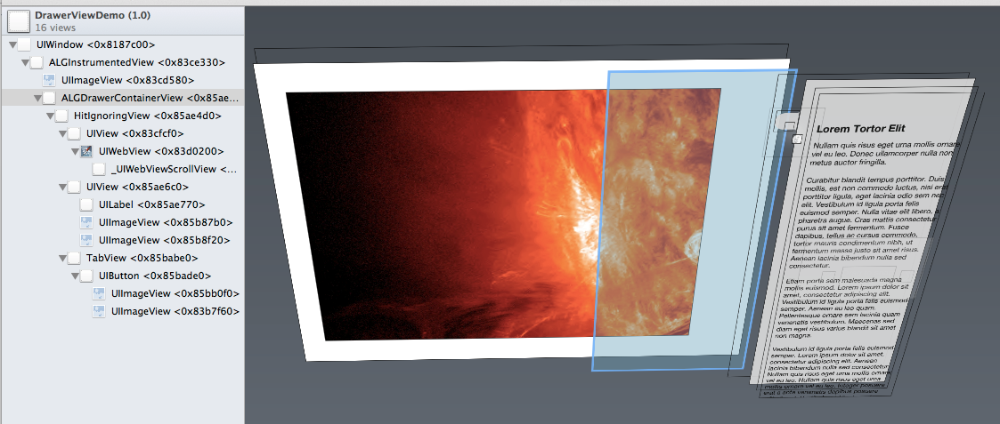
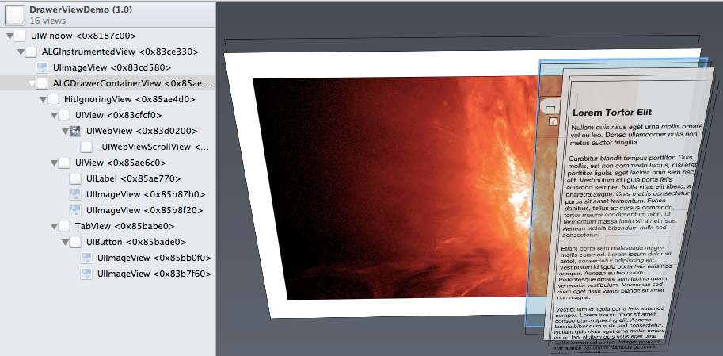

# ALGDrawerView

An iOS view for a "drawer" of HTML content, which lives above another view.

<div style="text-align: center">
</img>
</div>


## What, another drawer view?

Yes, there are plenty of drawer view components that let you slide away the main view to reveal a new view underneath, perhaps full of settings or navigation controls. This is not one of those components.

This is for presenting a drawer "on top" of the current view, in way that appears clearly separate from it, does not block interaction with it, looks a bit pseudo-physical, and can be shift out of the way if necessary.

This is especially handy for the imperfect situation where you need to place contextual information _on top_ of unpredictable content that expects to own the whole screen (e.g., a webpage). So you need that contextual information to be convenient and available, but you also don't want to obtruct key bits of the underlying content -- even though you can't predict where the key bits will be.

### Features 

User experience for this component:

- clean presentation of HTML content (without UIWebView artefacts)
- when closed, the drawer exposes only a tab hanging onto the screen
- tapping the tab opens/closes the drawer
- dragging the tab allows gradually opening/closing the drawer
- dragging & throwing the tab produces an animation with simulated physics (conservation of momentum; shudder on slam)
- dragging the tab far from the edge undocks the drawer from that edge, then allowing you to drag the drawer to the other side and re-dock it

Developer experience for this view:

- Requires minimal integration with your code, since it's well-encapsulated as a child view controller. To use it, just add the ALGDrawerViewController as a child controller, and its root view onto the region that you want the drawer to fill.
- Extensively customizable via #define parameters
    - color, translucency, size, position, and corner radii of the drawer
    - corner radii and dimensions of the drawer's tab
    - animations on dock/undock
    - etc.

To get a feel for what it looks like in action, just run the demo app.

**Requires at least iOS 6.**

## Installing it

You add the drawer component to your app in the standard (and somewhat cumbersome) way you add any view managed by a dedicated child view controller (here's [Apple's advice](https://developer.apple.com/library/ios/featuredarticles/ViewControllerPGforiPhoneOS/CreatingCustomContainerViewControllers/CreatingCustomContainerViewControllers.html#//apple_ref/doc/uid/TP40007457-CH18-SW13)).

For instance, say you wanted to add a drawer on top of your the view MyView, which is managed MyViewController. First you would add a snippet like the following to your `viewDidLoad`, to cause the drawer component to be loaded as well:


```
@implementation ALGViewController

// ...

- (void)viewDidLoad
{
  [super viewDidLoad];
  
  // create and initialize the DrawerVC
  DrawerViewController * dvc = [[UIStoryboard storyboardWithName:@"DrawerViewScene"
                                                          bundle:[NSBundle mainBundle]]
                               instantiateViewControllerWithIdentifier:@"DrawerViewControllerID"];
  
  dvc.drawerHTMLContentString = self.htmlContents;
  dvc.drawerDockingEdge = CGRectMaxXEdge;

  // add the DrawerVC as a child of the current VC
  [self addChildViewController:dvc];

  // add the DrawerVC's root view to the app's view hierarchy
  UIView * const drawerContainerView = [dvc view];
  [self.view addSubview:drawerContainerView];

  // tell the DrawerVC it is now a child VC
  [dvc didMoveToParentViewController:self];

  // save the DrawerVC and its view into weak properties on the parent VC
  self.drawerViewController = dvc;
  self.childContainerView = drawerContainerView;
}

// ...

@end
```

Second you would add a snippet like the following to your view's `layoutSubviews` or to your view controller's `viewWillLayoutSubviews`, to trigger the drawer view container to be properly positioned:

```
@implementation ALGViewController

// ...

- (void)viewWillLayoutSubviews
{
 [super viewWillLayoutSubviews];
 [self.drawerViewController layoutDrawerContainerOnly];
}

// ...

@end

```

## What is going on here?

The drawer view hierarchy is managed by its own dedicated DrawerViewController. The DrawerViewController holds a reference to the hierarchy's root in a public property, drawerContainerView, which must be added to your app's view hierarchy.

The drawerContainerView itself is just an invisible view, a which defines the region that the drawer should fill when the drawer is fully "open". When the drawer is closed, only its tab protrudes into that region. The drawerContainerView should be initially installed aligned to the inner edge of its superview, so that drawer slides in and out of that edge.

Really, a picture's worth a thousand words. This picture shows the view hierarchy when the drawer is slid out into the closed position:

<div style="text-align:center">
</img>
&nbsp;
</div>

And this one shows it open:
<div style="text-align:center">
</img>
</div>

In both cases, the drawerContainerView is right-aligned with the content view.

##License

See LICENSE.md


## Other drawers

As mentioned, there are loads of other components that let you slide away the visible view and see another screen underneath, like the Path or Facebook app. If that's what you need, then maybe you want one of these:

- [MMDrawerController](https://www.cocoacontrols.com/controls/mmdrawercontroller--2)
- [ECSlidingViewController](https://github.com/edgecase/ECSlidingViewController)
- [ViewDeck](https://github.com/Inferis/ViewDeck)

